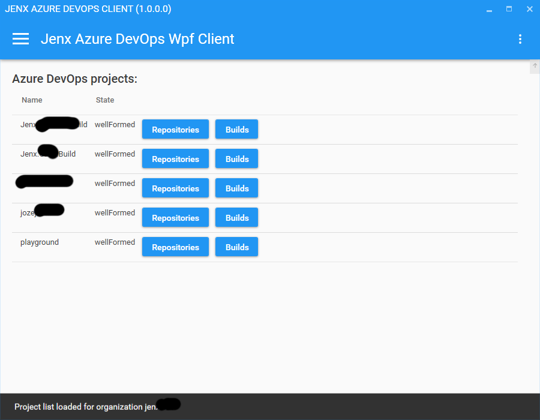
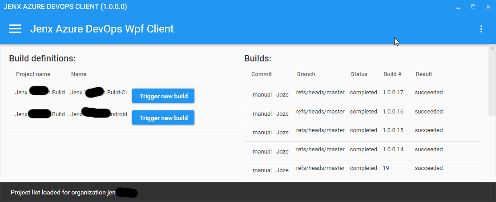
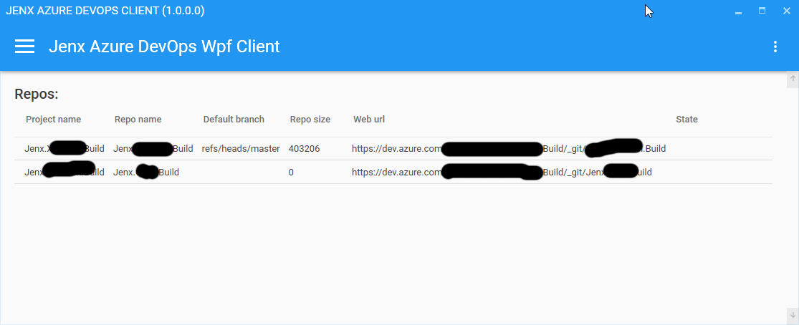
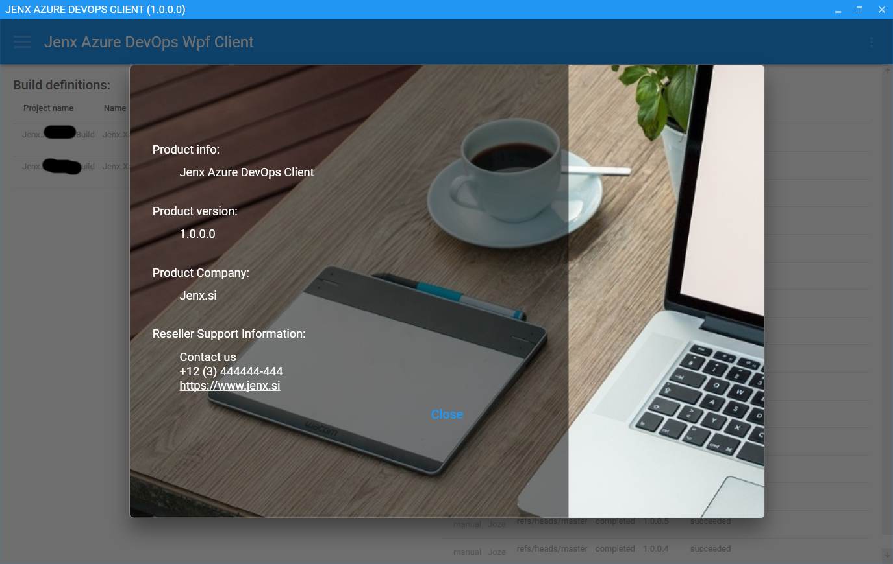
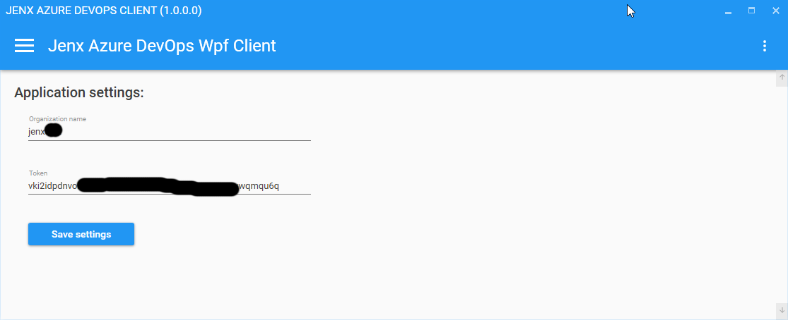
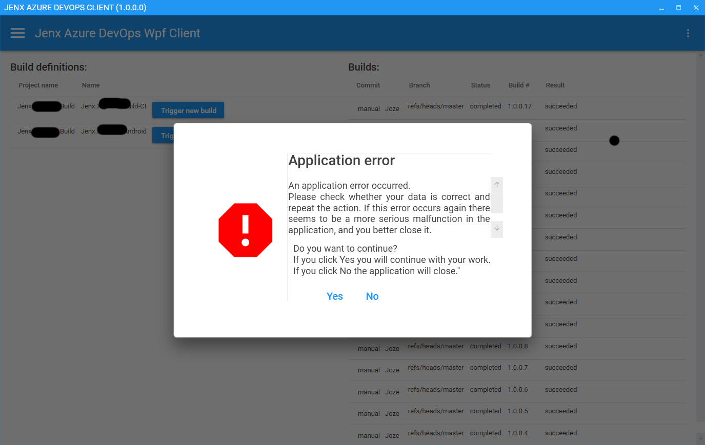
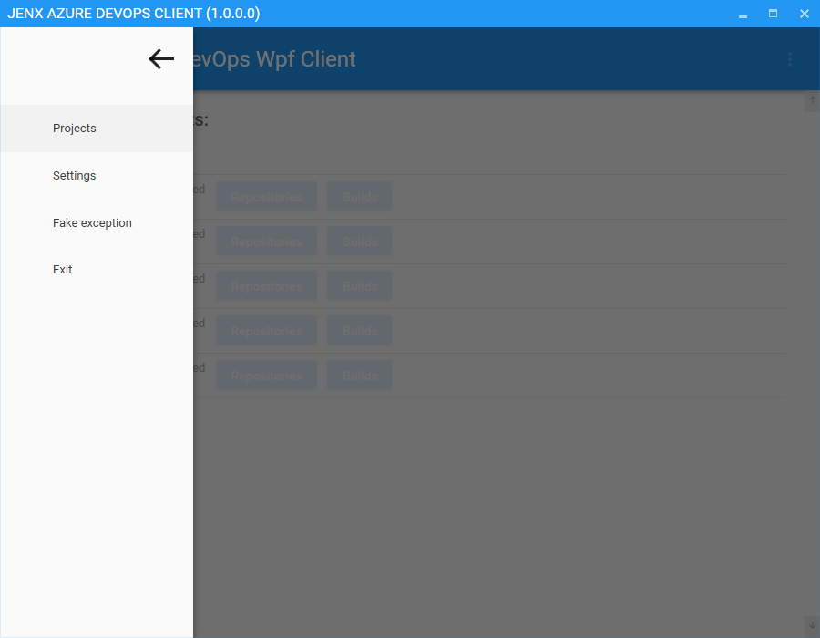

# Jenx Azure DevOps Client

## The purpose of this repository.
* Playing around with .NET Core 3.0 (Preview) and WPF. 
	* .NET Core 3.0 is the first version of .Net Core which support WPF desktop apps. So, for me it's interesting to check how WPF plays along with .NET Core 3.0.
	* I like also other .NET Core features, e.g. support for machine-global and application-local deployment, performance inprovements, etc... 
	
* For this puprose I created simple WPF Azure DevOps Client to make some proof-of-concepts.

* Playing around with just released Visual Studio 2019.

## App key features.
* Integrated Prism Library to create loosely coupled, maintainable, and testable application [[https://prismlibrary.github.io/](https://prismlibrary.github.io/ "Visit prism library ")].
* Unity used for DI. [[https://github.com/unitycontainer/unity](https://github.com/unitycontainer/unity "Unity Container")].
* Material Design In XAML Toolkit [[materialdesigninxaml.net](materialdesigninxaml.net "material design in xaml")].
* Mahapps UI toolkit for WPF [[https://mahapps.com/](https://mahapps.com/ "mahapps")].
* NLog for app logger.
* MVVM arhitecture.
* Garcefully handling of exceptions.
* Other features: IsBusy loader, animated popups, material design look-and-feel!
* etc.

## Domain 

* App can do basic Azure DevOps functions, like:
	* list Azure DevOps projects in organization,
	* list Azure DevOps repositories,
	* list Azure Build definitions and builds,
	* trigger new Build.

* First, you need to put Organization name and personal token into Settings page in order to have access to Azure DevOps backend.

## Summary

* Visual Studio 2019 is with no doubt top product. Again Microsoft did some marvelous work. VS2019 is still the best Dev IDE on the market. 
* .NET Core is on the right track! I like apporach they are doing. From code perspective I had no big problems with .NET Core 3.0 (preview) and WPF.
* 

## How to Engage, Contribute and Provide Feedback

Feel free to comment, play around with the app and fix issues.

## Some screenshoots

Builds and build definition

Repos

About popup with app inf from runing assembly

Settings

Exceptions

Menu

