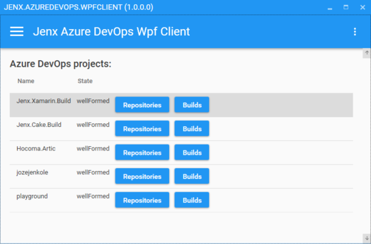

# Jenx AzureDevOps Client

## The purpose of this repository

* Playing around with .NET Core 3.0 (Preview) and WPF.
* Build a simple Wpf Azure DevOps Client to make some proof-of-concepts.
* Playing around with just released Visual Studio 2019.

## App key features

* Integrated Prism Library to create loosely coupled, maintainable, and testable application. [[https://prismlibrary.github.io/](https://prismlibrary.github.io/ "Visit prism library ")]
* Unity used for DI. [[https://github.com/unitycontainer/unity](https://github.com/unitycontainer/unity "Unity Container")]
* Material Design In XAML Toolkit [[materialdesigninxaml.net](materialdesigninxaml.net "material design in xaml")]
* Mahapps UI toolkit for WPF [[https://mahapps.com/](https://mahapps.com/ "mahapps")]
* NLog for app logger.
* MVVM arhitecture.
* Garcefully handling of exceptions
* Other features: IsBuisy loader, animated popups, material design look-and-feel!
* etc.

## Domain 

* App can list projects, repositories and builds in specified organization in Azure DevOps.
* You needto put OrgName and Personal token into Settings page and 
*

## How to Engage, Contribute and Provide Feedback

Feel free to coment, playaround and fix issues.

## Some screenshoots

Feel free to coment, playaround and fix issues.

